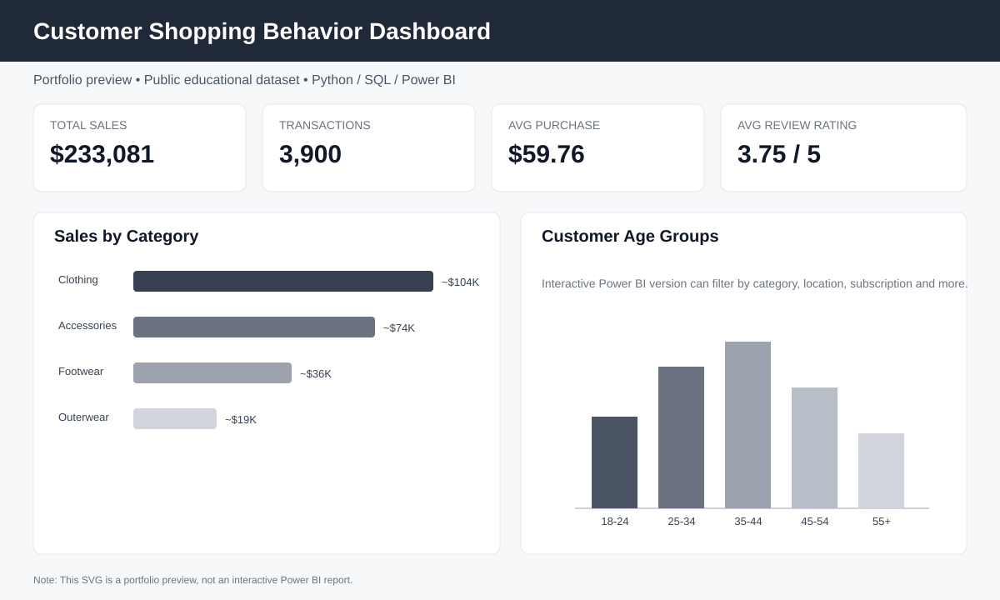

# Customer Shopping Behavior Analysis

Portfolio project analyzing customer shopping behavior using Python, SQL, Excel, and Power BI.

## Dashboard Preview



> This is a portfolio preview. It is not an interactive Power BI report.

## Project Overview

This educational portfolio project uses a public customer shopping dataset to demonstrate data cleaning, exploratory analysis, SQL analysis, KPI development, and dashboard design.

## Tools
- Python / Pandas
- SQL
- Excel
- Power BI

## Workflow
1. Load and inspect the source dataset.
2. Validate duplicates, missing values, and data types.
3. Clean and standardize the data.
4. Create age groups and analytical fields.
5. Generate KPI and category summaries.
6. Use SQL for business-focused analysis.
7. Build Power BI measures and dashboard views.

## Important Note
This is a self-directed portfolio project based on a public educational dataset. It is not client work.

## Repository Structure
```text
python/       Python data preparation and analysis
sql/          SQL business analysis queries
powerbi/      DAX measures for Power BI
```

## Key Questions
- What is total sales and average purchase value?
- Which categories generate the most sales?
- How does subscription status relate to purchasing behavior?
- Which locations and products have higher purchase activity?
- How frequently do customers purchase?
- How are discounts and payment methods distributed?

## Analysis Outputs

The Python workflow produces cleaned and summarized files for downstream Power BI analysis, including KPI, category, age-group, and location summaries.

## Source Dataset
The project uses the public `shopping_behavior_updated.csv` dataset from GitHub for educational analysis.
